# 🍎 Thimar – Grocery & Delivery App

Thimar is a grocery delivery mobile application built using **Flutter**, designed to provide a smooth and user-friendly shopping experience.  
The app allows users to browse fresh products, manage their carts, place orders, and track deliveries in real time.

It is developed using **BLoC state management**, **Dio + Retrofit** for API networking, and **SharedPreferences** for local data caching.  
Thimar focuses on performance, simplicity, and clean architecture to ensure a fast, reliable, and responsive experience for both customers and delivery drivers.

---

## 📝 About the App

Thimar helps users easily shop for daily groceries, fruits, vegetables, and other essentials from the comfort of their homes.  
With a clean interface, real-time notifications, and smooth checkout, it ensures a complete e-commerce experience on mobile.

The app also supports:
- 🧍 User authentication  
- 🏠 Address management  
- 📦 Order tracking  
- ❤️ Favorite lists  

All built using modern **Flutter + BLoC** architecture.

---

## 🚀 Features

- 🏬 **Home:** Displays featured products, categories, and offers in an attractive layout.  
- 🛍️ **Categories:** Browse products by type (fruits, vegetables, dairy, etc.).  
- 🔍 **Product Search & Filter:** Search by name or keyword, and apply filters (price, category, availability).  
- ❤️ **Favorites:** Add or remove items from favorites for easy access later.  
- 🛒 **Cart Management:** Add, remove, or update quantities of items in the cart.  
- 💰 **Checkout & Orders:** Complete orders with selected delivery address and payment options.  
- 🚚 **Order Tracking:** View order details, delivery status, and history.  
- 🧾 **Notifications:** Get alerts about offers, order updates, and messages.  
- 👤 **Profile Management:** View and edit personal information (name, phone, address, etc.).  
- 🏡 **Address Management:** Add, edit, or delete delivery addresses.  
- 🔐 **Authentication:** Login, register, and reset password securely.  
- 💬 **Contact & Support:** Reach customer service for help or inquiries.  
- 💾 **Local Data Caching:** Cache user data (token, preferences) using SharedPreferences.  
- 🌐 **API Integration:** Uses Dio + Retrofit for all network requests.  
- ⚙️ **State Management:** Built with BLoC / Cubit pattern for predictable app states.

---

## 📱 App Screenshots

  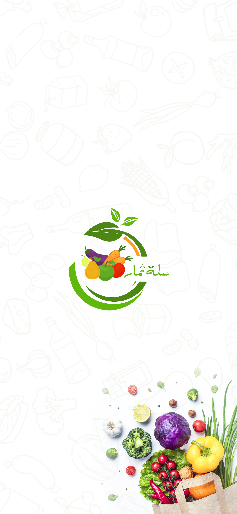
  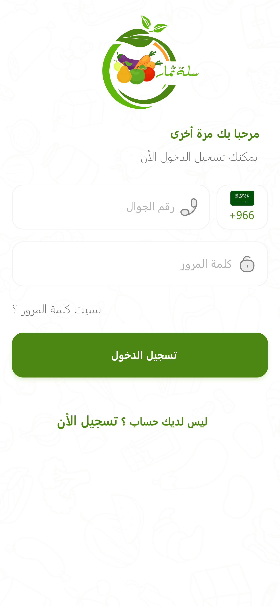
  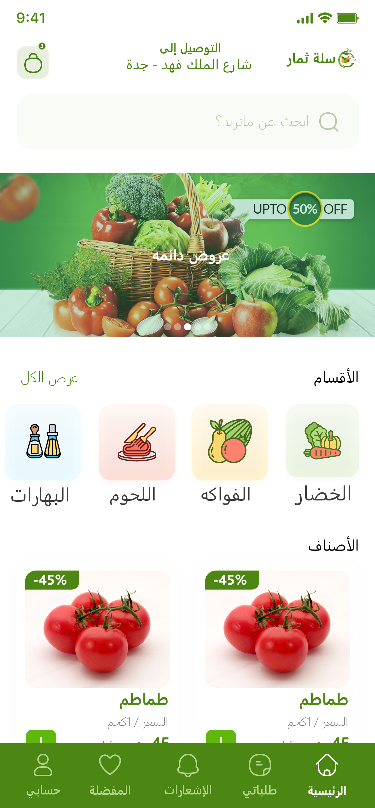

  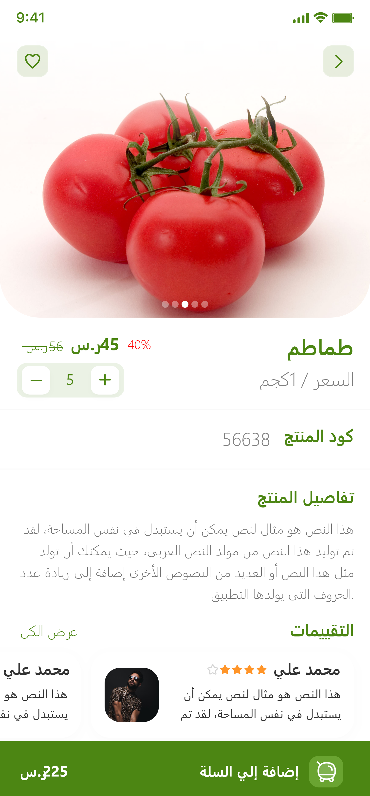
  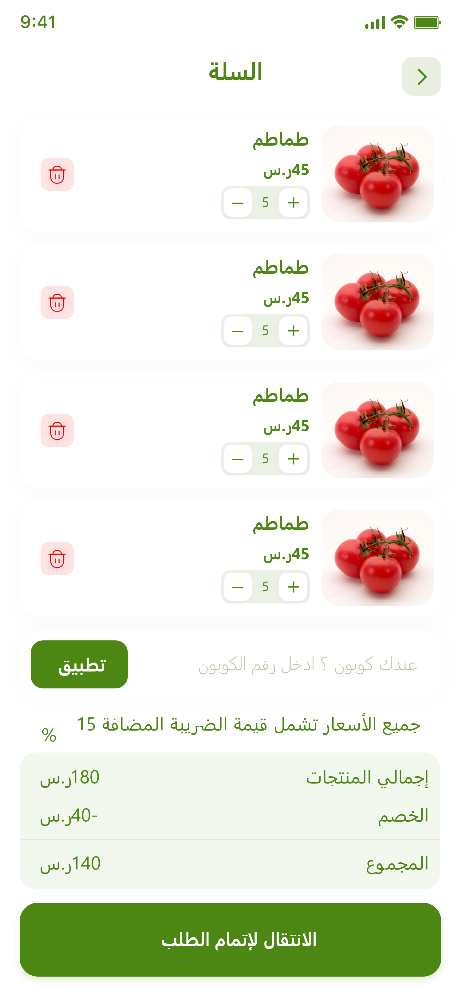
  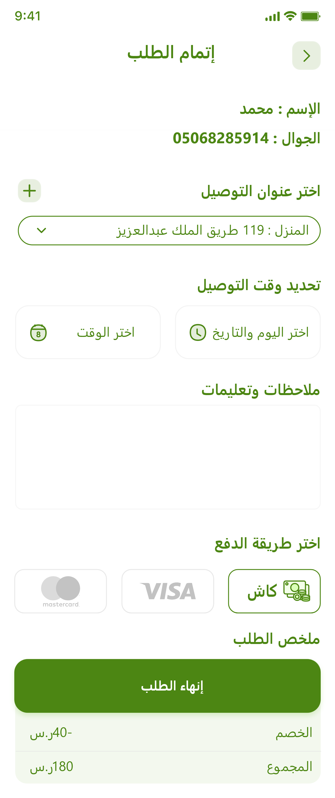

  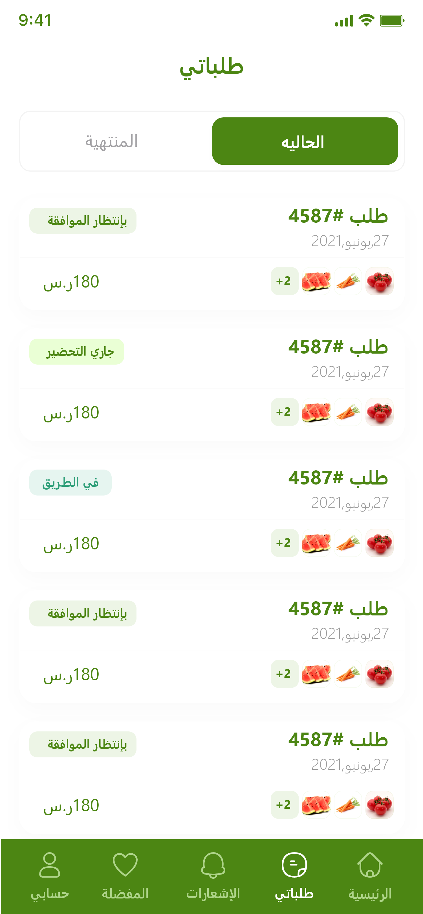
  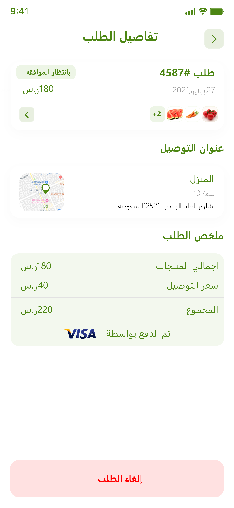
  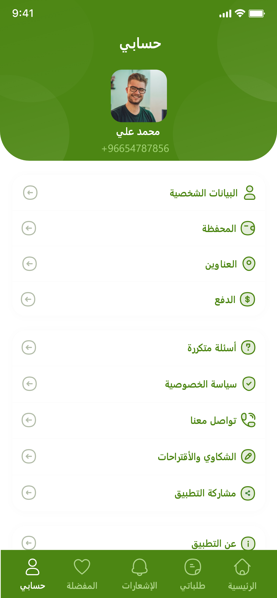

  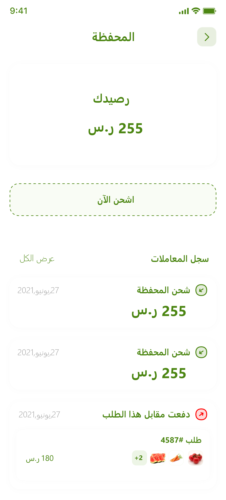
  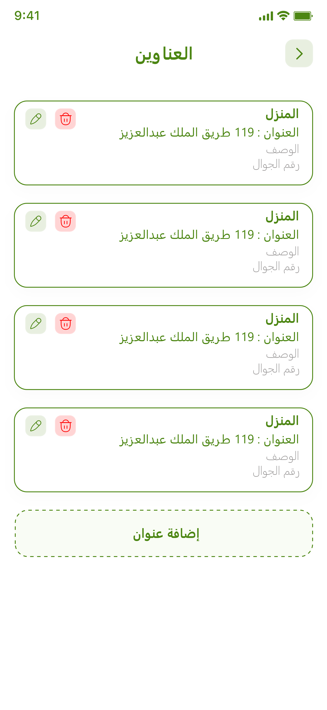

---

## 🧰 Installation

Before running the project, make sure you have the following installed:

- ✅ Flutter SDK  
- ✅ Android Studio or Visual Studio Code  
- ✅ Emulator or physical Android/iOS device  

---

## 🧑‍💻 Tech Stack

- Flutter  
- Dart  
- BLoC / Cubit  
- Dio + Retrofit  
- SharedPreferences  
- RESTful API
